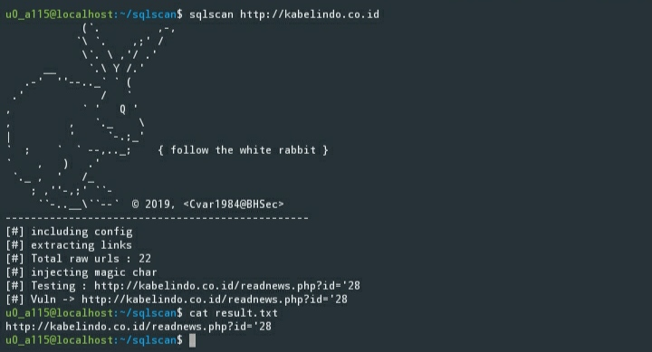

# sqlscan
> sqlscan is quick web scanner for find an sql inject point.
>
> use sitemap for best result

- Simple to use
- Support PHP 5.5

## Installation

requires [php](https://php.net ) to run.
### PHP Depencies
- ext-bz2

### Install the software.

```sh
$ sudo apt install php php-bz2 php-curl curl
$ sudo curl https://raw.githubusercontent.com/Cvar1984/sqlscan/dev/build/main.phar --output /usr/local/bin/sqlscan
$ chmod +x /usr/local/bin/sqlscan
$ sqlscan http://example.gov
$ sqlscan list_url.txt
```

### For Android Termux environments

```sh
$ apt install php curl
$ curl https://raw.githubusercontent.com/Cvar1984/sqlscan/dev/build/main.phar --output $PREFIX/bin/sqlscan
$ chmod +x $PREFIX/bin/sqlscan
$ sqlscan http://example.gov
$ sqlscan list_url.txt
```

## Todo

 - Bypass waf
 - url from json

## License
> Copyright (c) 2019 <Cvar1984>
>
> Licensed unter the Apache License, Version 2.0 or the MIT license, at your
> option.
>
> ********************************************************************************
>
> Permission is hereby granted, free of charge, to any person obtaining a copy of
> this software and associated documentation files (the "Software"), to deal in
> the Software without restriction, including without limitation the rights to
> use, copy, modify, merge, publish, distribute, sublicense, and/or sell copies of
> the Software, and to permit persons to whom the Software is furnished to do so,
> subject to the following conditions:
>
> The above copyright notice and this permission notice shall be included in all
> copies or substantial portions of the Software.
>
> THE SOFTWARE IS PROVIDED "AS IS", WITHOUT WARRANTY OF ANY KIND, EXPRESS OR
> IMPLIED, INCLUDING BUT NOT LIMITED TO THE WARRANTIES OF MERCHANTABILITY, FITNESS
> FOR A PARTICULAR PURPOSE AND NONINFRINGEMENT. IN NO EVENT SHALL THE AUTHORS OR
> COPYRIGHT HOLDERS BE LIABLE FOR ANY CLAIM, DAMAGES OR OTHER LIABILITY, WHETHER
> IN AN ACTION OF CONTRACT, TORT OR OTHERWISE, ARISING FROM, OUT OF OR IN
> CONNECTION WITH THE SOFTWARE OR THE USE OR OTHER DEALINGS IN THE SOFTWARE.
>
> ********************************************************************************
>
> Licensed under the Apache License, Version 2.0 (the "License");
> you may not use this file except in compliance with the License.
> You may obtain a copy of the License at
>
>   http://www.apache.org/licenses/LICENSE-2.0
>
> Unless required by applicable law or agreed to in writing, software
> distributed under the License is distributed on an "AS IS" BASIS,
> WITHOUT WARRANTIES OR CONDITIONS OF ANY KIND, either express or implied.
> See the License for the specific language governing permissions and
> limitations under the License.
